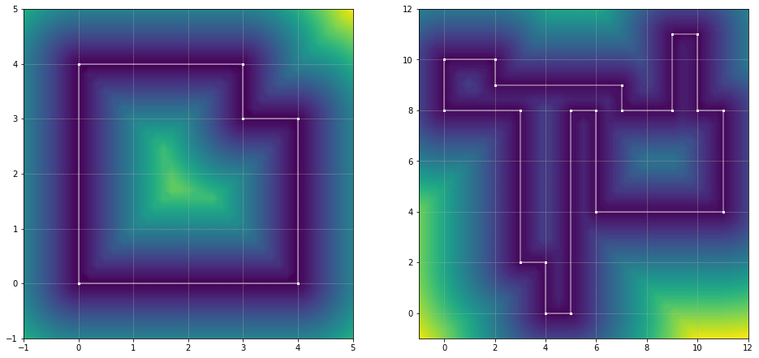
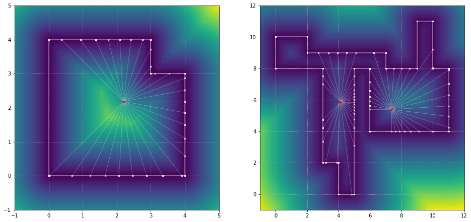
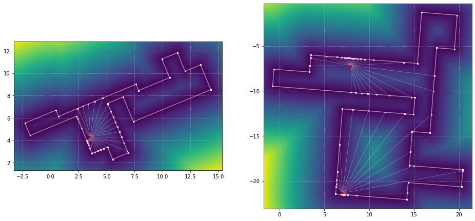

# Jin Scan Simulation

This is a package for generating simulated scans.

Right now things work for:

- [x] 2D grid polygons
- [x] 2D rectilinear polygons
- [ ] 3D grid polygons
- [ ] 3D rectilinear polygons

## Installation:

*Can someone please test these instructions? I'm unsure if building the package is actually necessary. Try only steps 1., 4., 5., and 6. and let me know if it works.*

Using conda:

1. clone the source
2. run `python3 -m pip install --upgrade build` to install the latest version of PyPA's build tool
3. run `python3 -m build` in the root directory (the same folder where `pyproject.toml` is located)
4. in the root folder, run `conda develop ./src/ <env>` to add the root directory to the environment paths in the `<env>` environment
5. you should now be able to `import` desired packages, ex. `import jin_scan_simulation.datasets`.
6. cross your fingers

## Usage:

Assume we have access to a one or more datafiles `<name>_<filenumber>.npy`.
For example we might have a data directory that looks like this.

```
data/
|-run1k_0.npy
|-run1k_1.npy
```

*The data used to generate the example figures is available on request. If you are aware of a good way to host data for machine learning reproducibility please let me know.*

In each of these files we expect to find an array of shape `(n_polygons, n_vertices, 2)`.
The polygons in these files should all have the same number of vertices (i.e. the arrays should not be ragged).
For each polygon we have `n_vertices` pairs of `x` and `y` coordinates.

First, these polygons should be loaded into into a `GridPolygonDataset`.
As the name suggests, currently only grid-aligned polygons can be loaded.

```python
from matplotlib import pyplot as plt
from pathlib import Path
from jin_scan_simulation.datasets import GridPolygonDataset

data_folder = Path("<root>/data/")
gpd = GridPolygonDataset(seed=2)
# this seed is used to set the seed of all polygons in the dataset
gpd.load_polygons(name="run1k", _VERTEX_DATA_DIR=data_folder)
```

We can now visualise one of the polygons from our dataset, along with its associated Euclidean distance field.

```python
fig, (ax1, ax2) = plt.subplots(nrows=1, ncols=2, figsize=(16,8))
gp1, gp2 = gpd[0], gpd[-1]
gp1.plot(ax1)
gp2.plot(ax2)
```



We can now simulate some scans.

```python
# plot rays for grid polygon
# single pose
source1 = gp1.sample_interior(n_samples=1, minimium_dist=0.01)
thetas1 = np.array([0])
# multiple (2) poses
source2 = gp2.sample_interior(n_samples=2, minimium_dist=0.01)
thetas2 = np.array([0, np.pi/4])
# NOTE: the minimum_dist keywords does not work as expected at the moment

# raycast for single pose
ray_endpoints1 = gp1.raycast(
    source=source1, absolute_theta=thetas1, n_rays=27, tol=1e-2,
    maxiter=128
)
# raycast for multiple poses
ray_endpoints2 = gp2.raycast(
    source=source2, absolute_theta=thetas2, n_rays=27, tol=1e-2,
    maxiter=128
)

fig, (ax1, ax2) = plt.subplots(nrows=1, ncols=2, figsize=(16,8))
gp1.plot(ax1)
gp2.plot(ax2)
gp1.plot_rays(
    ax1, source1, ray_endpoints1, absolute_theta=thetas1
)
gp2.plot_rays(
    ax2, source2, ray_endpoints2, absolute_theta=thetas2
)
```



```python
# transform grid polygons

rp1 = gp2.transform(angle=np.pi/8, scalex=1.5, scaley=0.6)
rp2 = gp2.transform()  # random transform

# plot rays for rectilinear polygon
# single pose
source1 = rp1.sample_interior(n_samples=1, minimium_dist=0.01)
thetas1 = np.array([0])
# multiple (2) poses
source2 = rp2.sample_interior(n_samples=2, minimium_dist=0.01)
thetas2 = np.array([0, np.pi/4])
# NOTE: the minimum_dist keywords does not work as expected at the moment

# raycast for single pose
ray_endpoints1 = rp1.raycast(
    source=source1, absolute_theta=thetas1, n_rays=27, tol=1e-2,
    maxiter=128
)
# raycast for multiple poses
ray_endpoints2 = rp2.raycast(
    source=source2, absolute_theta=thetas2, n_rays=27, tol=1e-2,
    maxiter=128
)

fig, (ax1, ax2) = plt.subplots(nrows=1, ncols=2, figsize=(16,8))
rp1.plot(ax1)
rp2.plot(ax2)
rp1.plot_rays(
    ax1, source1, ray_endpoints1, absolute_theta=thetas1
)
rp2.plot_rays(
    ax2, source2, ray_endpoints2, absolute_theta=thetas2
)
```


